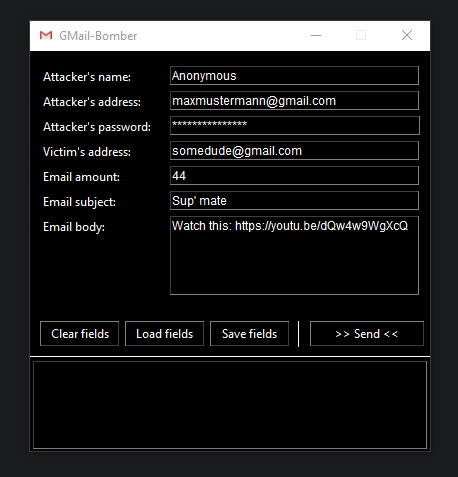

# GMail-Bomber

[](https://en.wikipedia.org/wiki/Python_(programming_language)) 
[](https://en.wikipedia.org/wiki/Simple_Mail_Transfer_Protocol) 
[](https://github.com/TosoxDev/GMail-Bomber)
[](https://github.com/TosoxDev/GMail-Bomber)
[](https://github.com/TosoxDev/GMail-Bomber/releases)

**A basic email spammer developed in Python**

## Important

> ### Make sure to create an App Password for the sender's Google account.
> ### Check this article for more information: https://support.google.com/accounts/answer/185833

## Usage

### Run as python script:

```bash
> python ./gmail_bomber.py
```

_Alternatively, simply execute ['start.bat'](start.bat)_

### Run as executable:

> Note: pyinstaller is required. Install it with 'pip install pyinstaller'

- Open a console window in the main directory and run

```bash
# Example
> pyinstaller --icon=res/icon.ico --onefile --noconsole ./gmail_bomber.py
```

_Alternatively, simply execute ['build.bat'](build.bat)_

## Media


